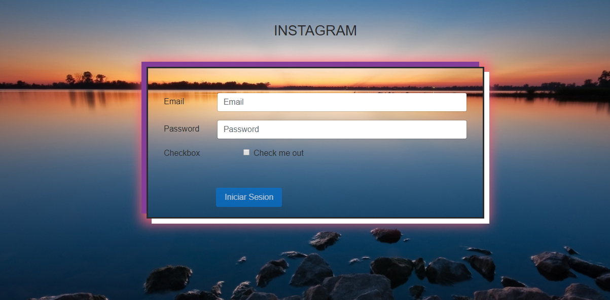
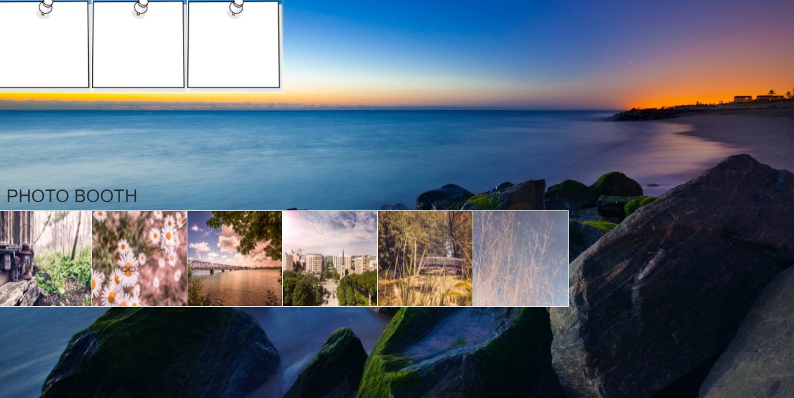
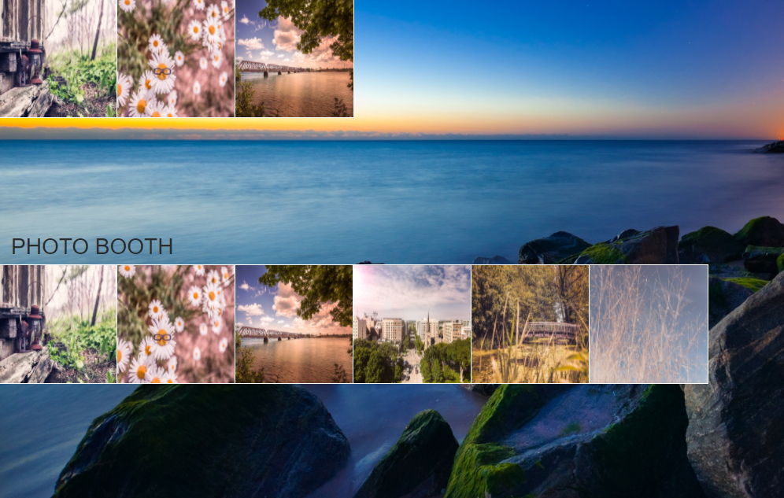

# INSTA COLLAGE

**OBJETIVO** 
+ Crear un collage y usar la API de HTML5 Drag and Drop (DnD). La parte superior muestra las imágenes que se arrastrarán y soltarán y en la parte de abajo están las fotos con las que el usuario podrá interactuar.

## Fuentes utilizadas:

+ Lo que más se utilizó fueron videos tutoriales, algunos foros y el LMS.

### Funcionalidad

**Flujo de la aplicación**

__________________________________________________________________________________________________

__________________________________________________________________________________________________

__________________________________________________________________________________________________

__________________________________________________________________________________________________

### Herramientas Utilizadas

+ HTML5.
+ Javascript 5.
+ Hoja de estilos.
+ API de HTML Drag and Drop (DnD).
+ ES6.
